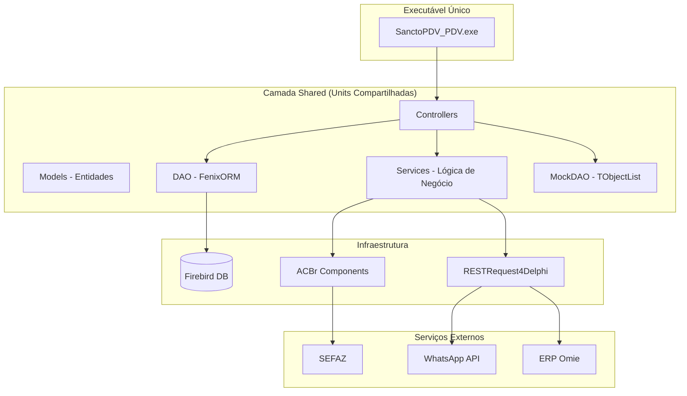
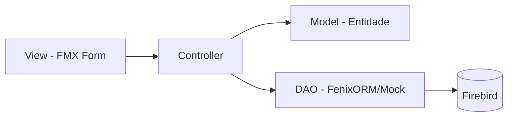
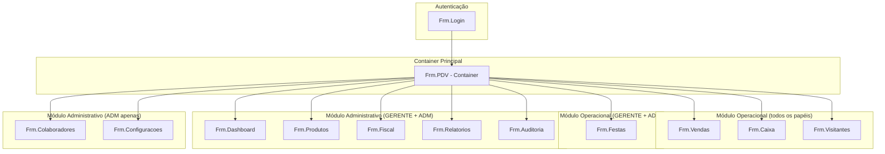
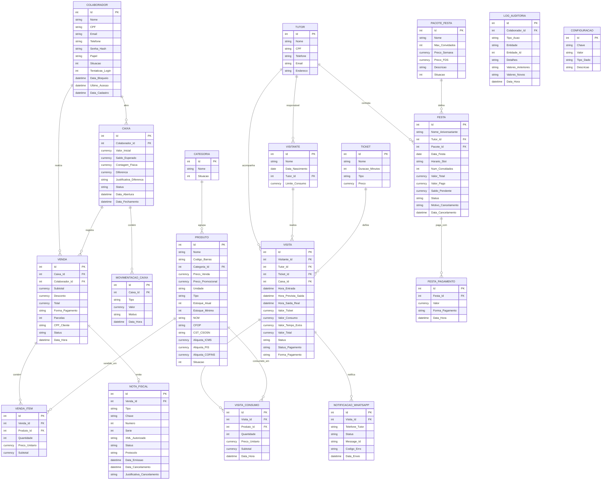

# Design Document — Sancto PDV Delphi

## Overview

O Sancto PDV é um sistema unificado de Ponto de Venda para parques temáticos infantis indoor, composto por um **único executável** Delphi 10.2 Tokyo com interface FireMonkey (FMX):

- **SanctoPDV_PDV.exe** — Aplicação unificada que centraliza operação diária (vendas, caixa, visitantes, festas) e administração (produtos, colaboradores, fiscal, relatórios, configurações), com controle de acesso baseado em papéis.

O sistema utiliza **FenixORM** (modo local com FireDAC + Firebird) para persistência, **ACBr** para emissão fiscal (NFC-e/NF-e), e **RESTRequest4Delphi** para integrações REST (WhatsApp Business API e ERP Omie).

A primeira entrega será um **MOCK funcional** com `TObjectList<T>` em memória simulando o FenixORM, permitindo validação completa de layouts e navegação antes da integração com banco real.

---

## Architecture

### Diagrama de Alto Nível



### Padrão Arquitetural: Model → Controller → DAO → View



### Controle de Acesso por Papel (Executável Único)

| Módulo | OPERACIONAL | GERENTE | ADMINISTRADOR |
|--------|:-----------:|:-------:|:-------------:|
| **Vendas** | ✓ | ✓ | ✓ |
| **Caixa** | ✓ | ✓ | ✓ |
| **Visitantes** | ✓ | ✓ | ✓ |
| **Festas** | — | ✓ | ✓ |
| **Dashboard** | — | ✓ | ✓ |
| **Produtos** | — | ✓ | ✓ |
| **Colaboradores** | — | — | ✓ |
| **Fiscal** | — | ✓ | ✓ |
| **Relatórios** | — | ✓ | ✓ |
| **Configurações** | — | — | ✓ |
| **Auditoria** | — | ✓ | ✓ |

### Regra de Design-Time: Par .fmx + .pas Obrigatório

**Todas as telas do sistema DEVEM possuir o par de arquivos `.fmx` (layout visual) + `.pas` (código)**, permitindo edição completa no Form Designer do Delphi IDE.

**Proibido:**
- Criar componentes visuais em tempo de execução (runtime)
- Montar layouts dinamicamente via código
- Usar frames/panels criados por código sem representação no .fmx

**Obrigatório:**
- Todo componente visual (botões, labels, panels, grids, listviews, edits, etc.) deve ser posicionado no .fmx via Form Designer
- A propriedade `Visible` pode ser alterada em runtime para controle de acesso por papel, mas o componente deve existir no .fmx
- Dialogs modais que necessitam de layout próprio também devem ter seu par .fmx + .pas separado
- O código no .pas deve apenas manipular dados e estado dos componentes já existentes no .fmx

**Motivo:** Manter todas as telas editáveis visualmente na IDE, facilitar manutenção, e permitir ajustes de layout sem recompilar lógica.

### Estrutura de Diretórios do Projeto

```
SanctoFMX/
├── PDV/
│   ├── SanctoPDV_PDV.dpr
│   ├── SanctoPDV_PDV.dproj
│   └── Forms/
│       ├── Frm.PDV.fmx + .pas              (container principal)
│       ├── Frm.Main.PDV.fmx + .pas         (tela principal com navegação)
│       ├── Frm.Vendas.fmx + .pas           (vendas com 3 painéis)
│       ├── Frm.Caixa.fmx + .pas            (controle de caixa)
│       ├── Frm.Visitantes.fmx + .pas       (visitantes com timer)
│       ├── Frm.Festas.fmx + .pas           (agendamento de festas)
│       ├── Frm.Dashboard.fmx + .pas        (indicadores — ADM/GER)
│       ├── Frm.Produtos.fmx + .pas         (CRUD produtos — ADM/GER)
│       ├── Frm.Colaboradores.fmx + .pas    (CRUD colaboradores — ADM)
│       ├── Frm.PacotesFesta.fmx + .pas     (pacotes de festa — ADM)
│       ├── Frm.Fiscal.fmx + .pas           (config fiscal — ADM/GER)
│       ├── Frm.Relatorios.fmx + .pas       (relatórios — ADM/GER)
│       ├── Frm.Configuracoes.fmx + .pas    (config sistema — ADM)
│       └── Frm.Auditoria.fmx + .pas        (log auditoria — ADM/GER)
├── Shared/
│   ├── Models/
│   │   ├── Model.Entidade.Colaborador.pas
│   │   ├── Model.Entidade.Produto.pas
│   │   ├── Model.Entidade.Categoria.pas
│   │   ├── Model.Entidade.Caixa.pas
│   │   ├── Model.Entidade.MovimentacaoCaixa.pas
│   │   ├── Model.Entidade.Venda.pas
│   │   ├── Model.Entidade.VendaItem.pas
│   │   ├── Model.Entidade.Visitante.pas
│   │   ├── Model.Entidade.Visita.pas
│   │   ├── Model.Entidade.VisitaConsumo.pas
│   │   ├── Model.Entidade.Tutor.pas
│   │   ├── Model.Entidade.Ticket.pas
│   │   ├── Model.Entidade.Festa.pas
│   │   ├── Model.Entidade.PacoteFesta.pas
│   │   ├── Model.Entidade.FestaPagamento.pas
│   │   ├── Model.Entidade.NotaFiscal.pas
│   │   ├── Model.Entidade.Configuracao.pas
│   │   ├── Model.Entidade.LogAuditoria.pas
│   │   └── Model.Entidade.NotificacaoWhatsApp.pas
│   ├── Controllers/
│   │   ├── Controller.Base.pas
│   │   ├── Controller.Colaborador.pas
│   │   ├── Controller.Produto.pas
│   │   ├── Controller.Caixa.pas
│   │   ├── Controller.Venda.pas
│   │   ├── Controller.Visitante.pas
│   │   ├── Controller.Festa.pas
│   │   ├── Controller.Fiscal.pas
│   │   ├── Controller.Relatorio.pas
│   │   ├── Controller.Configuracao.pas
│   │   └── Controller.Auditoria.pas
│   ├── Services/
│   │   ├── Service.Autenticacao.pas
│   │   ├── Service.WhatsApp.pas
│   │   ├── Service.Omie.pas
│   │   └── Service.Fiscal.pas
│   ├── Mock/
│   │   └── Mock.DAO.pas
│   ├── Forms/
│   │   └── Frm.Login.fmx + .pas
│   ├── Utils/
│   │   ├── Rtti.Atributos.pas
│   │   ├── Utils.Exceptions.pas
│   │   └── Utils.Theme.pas
│   └── ORM/
│       ├── FenixORM.pas
│       ├── FenixRTTI.pas
│       └── FenixSQL.pas
└── ORM/ (FenixORM original)
    ├── FenixORM.pas
    ├── FenixRTTI.pas
    └── FenixSQL.pas
```

---

## Components and Interfaces

### Interface IDAO (Abstração para Mock e Real)

Para permitir a troca transparente entre Mock (TObjectList) e FenixORM real:

```pascal
type
  IDAO<T: class> = interface
    function Insert(AEntity: T): Boolean;
    function Update(AEntity: T): Boolean;
    function Delete(AEntity: T): Boolean;
    function Save(AEntity: T): Boolean;
    function Find(const AId: Integer): T;
    function FindAll(const AFiltro: string = ''): TObjectList<T>;
    function Count(const AFiltro: string = ''): Integer;
    function Where(const ACampo: string; const AValor: TValue): IDAO<T>;
    function LastId: Integer;
    procedure BeginTransaction;
    procedure Commit;
    procedure Rollback;
  end;
```

### MockDAO — Implementação com TObjectList

```pascal
type
  TMockDAO<T: class, constructor> = class(TInterfacedObject, IDAO<T>)
  private
    FLista: TObjectList<T>;
    FNextId: Integer;
    FInTransaction: Boolean;
    FSnapshot: TObjectList<T>; // backup para rollback
  public
    constructor Create;
    destructor Destroy; override;
    function Insert(AEntity: T): Boolean;
    function Update(AEntity: T): Boolean;
    function Delete(AEntity: T): Boolean;
    function Save(AEntity: T): Boolean;
    function Find(const AId: Integer): T;
    function FindAll(const AFiltro: string = ''): TObjectList<T>;
    function Count(const AFiltro: string = ''): Integer;
    function Where(const ACampo: string; const AValor: TValue): IDAO<T>;
    function LastId: Integer;
    procedure BeginTransaction;
    procedure Commit;
    procedure Rollback;
  end;
```

**Decisão de Design**: O MockDAO simula transações criando um snapshot da lista antes de `BeginTransaction`. Em caso de `Rollback`, a lista é restaurada do snapshot. Isso permite validar os fluxos de tela que dependem de transações sem banco real.

### Controller Base

```pascal
type
  TControllerBase<T: class, constructor> = class
  private
    FDAO: IDAO<T>;
    FEntidade: T;
    FUsarMock: Boolean;
  protected
    procedure CriarDAO; virtual;
  public
    constructor Create; overload;
    constructor Create(const AId: Integer); overload;
    destructor Destroy; override;
    property Entidade: T read FEntidade write FEntidade;
    property DAO: IDAO<T> read FDAO;
    function Gravar: Boolean; virtual;
    function Validar: Boolean; virtual; abstract;
    function Delete: Boolean; virtual;
    procedure RegistrarAuditoria(const ATipo: string; const ADetalhes: string);
  end;
```

### Service.Autenticacao

```pascal
type
  TResultadoLogin = (rlSucesso, rlCredencialInvalida, rlContaBloqueada, 
                     rlContaInativa, rlErroInterno);

  TServiceAutenticacao = class
  private
    FControllerColaborador: TControllerColaborador;
    FMaxTentativas: Integer; // 5
    FTempoBloqueioMin: Integer; // 15
    FTimeoutSessaoMin: Integer; // 30
    function VerificarBloqueio(AColaborador: TColaborador): Boolean;
    function VerificarSenha(const ASenhaInformada, AHashArmazenado: string): Boolean;
    procedure IncrementarTentativas(AColaborador: TColaborador);
    procedure BloquearConta(AColaborador: TColaborador);
    procedure ZerarTentativas(AColaborador: TColaborador);
  public
    function Login(const ACPF, ASenha: string): TResultadoLogin;
    procedure Logout(AColaboradorId: Integer);
    function SessaoExpirada(AUltimaAtividade: TDateTime): Boolean;
    class function GerarHash(const ASenha: string): string;
    class function VerificarHash(const ASenha, AHash: string): Boolean;
  end;
```

### Service.Fiscal (ACBr)

```pascal
type
  TResultadoFiscal = record
    Sucesso: Boolean;
    ChaveNFe: string;
    XMLAutorizado: string;
    Protocolo: string;
    MensagemErro: string;
    EmContingencia: Boolean;
  end;

  TServiceFiscal = class
  private
    FACBrNFe: TACBrNFe;
    FConfiguracao: TConfiguracaoFiscal;
    procedure ConfigurarACBr;
    procedure PreencherNFe(AVenda: TVenda; AItens: TObjectList<TVendaItem>);
    procedure PreencherDadosProduto(AItem: TVendaItem; ADet: TNFeItemDet);
  public
    constructor Create(AConfig: TConfiguracaoFiscal);
    destructor Destroy; override;
    function EmitirNFCe(AVenda: TVenda; AItens: TObjectList<TVendaItem>): TResultadoFiscal;
    function CancelarNFCe(ANotaFiscal: TNotaFiscal; const AJustificativa: string): TResultadoFiscal;
    function ValidarCertificado: Boolean;
    function DiasParaExpiracaoCertificado: Integer;
    procedure RetransmitirContingencias;
  end;
```

### Service.WhatsApp (RESTRequest4Delphi)

```pascal
type
  TResultadoWhatsApp = record
    Sucesso: Boolean;
    MessageId: string;
    CodigoErro: string;
    MensagemErro: string;
  end;

  TServiceWhatsApp = class
  private
    FToken: string;
    FPhoneNumberId: string;
    FTemplateId: string;
    FConfigurado: Boolean;
    function MontarPayload(const ANomeCrianca: string; AMinutosRestantes: Integer;
      const ATelefoneTutor: string): string;
  public
    constructor Create(AConfig: TConfiguracaoWhatsApp);
    function EnviarAlertaExpiracao(const ANomeCrianca: string;
      AMinutosRestantes: Integer; const ATelefoneTutor: string): TResultadoWhatsApp;
    function EstaConfigurado: Boolean;
  end;
```

### Service.Omie (RESTRequest4Delphi)

```pascal
type
  TResultadoSincronizacao = record
    TotalEnviado: Integer;
    TotalSucesso: Integer;
    TotalFalha: Integer;
    Erros: TArray<string>;
  end;

  TServiceOmie = class
  private
    FAppKey: string;
    FAppSecret: string;
    FEndpointURL: string;
    FConfigurado: Boolean;
    function ChamarAPI(const AMetodo: string; const AParams: string): IResponse;
  public
    constructor Create(AConfig: TConfiguracaoOmie);
    function SincronizarProdutos(AProdutos: TObjectList<TProduto>): TResultadoSincronizacao;
    function SincronizarClientes(ATutores: TObjectList<TTutor>): TResultadoSincronizacao;
    function EnviarNotaFiscal(ANota: TNotaFiscal): Boolean;
    function EstaConfigurado: Boolean;
  end;
```

### Estrutura de Forms FMX (Executável Único)



### Layout da Tela Principal (Frm.PDV)

```
┌─────────────────────────────────────────────────────────────────┐
│ Header: Logo | Colaborador Logado | Caixa #ID | [Logout]        │
├────────┬────────────────────────────────────────────────────────┤
│        │                                                        │
│  Menu  │            Área de Conteúdo                            │
│ Lateral│         (Frame/Form embarcado)                         │
│        │                                                        │
│ ┌────┐ │                                                        │
│ │Vend│ │                                                        │
│ ├────┤ │                                                        │
│ │Caix│ │                                                        │
│ ├────┤ │                                                        │
│ │Visi│ │                                                        │
│ ├────┤ │                                                        │
│ │Fest│ │  (visível conforme papel do colaborador)               │
│ ├────┤ │                                                        │
│ │Dash│ │                                                        │
│ ├────┤ │                                                        │
│ │Prod│ │                                                        │
│ ├────┤ │                                                        │
│ │Cola│ │                                                        │
│ ├────┤ │                                                        │
│ │Fisc│ │                                                        │
│ ├────┤ │                                                        │
│ │Rela│ │                                                        │
│ ├────┤ │                                                        │
│ │Conf│ │                                                        │
│ └────┘ │                                                        │
├────────┴────────────────────────────────────────────────────────┤
│ Footer: Status Fiscal | Hora | Alertas                          │
└─────────────────────────────────────────────────────────────────┘
```

### Layout da Tela de Vendas

```
┌─────────────────────────────────────────────────────────────────┐
│                                                                  │
│ Categ. │    Grid de Produtos (Cards)      │   Carrinho          │
│        │                                  │                     │
│ [Todos]│  ┌────┐ ┌────┐ ┌────┐ ┌────┐   │   Item 1    R$ X    │
│ [Bebi] │  │Prod│ │Prod│ │Prod│ │Prod│   │   Item 2    R$ Y    │
│ [Lanch]│  │ 01 │ │ 02 │ │ 03 │ │ 04 │   │   Item 3    R$ Z    │
│ [Ticke]│  └────┘ └────┘ └────┘ └────┘   │                     │
│ [Docei]│                                  │   ─────────────     │
│ [Outro]│  ┌────┐ ┌────┐ ┌────┐ ┌────┐   │   Subtotal: R$ XX   │
│        │  │Prod│ │Prod│ │Prod│ │Prod│   │   Desconto: R$ YY   │
│        │  │ 05 │ │ 06 │ │ 07 │ │ 08 │   │   TOTAL:    R$ ZZ   │
│        │  └────┘ └────┘ └────┘ └────┘   │                     │
│        │                                  │   [Cancelar] [Pagar]│
└─────────────────────────────────────────────────────────────────┘
```

**Decisão de Design — UI Touch**: Todos os cards de produto possuem área mínima de 48x48px com espaçamento de 8px. Fontes de 14pt (info) e 18pt (botões). Feedback visual em <100ms com animação de escala no `OnMouseDown`.

---

## Data Models

### Diagrama Entidade-Relacionamento



### Modelo Delphi — Exemplos de Entidades

```pascal
type
  [Tabela('COLABORADOR')]
  TColaborador = class
  private
    FId: Integer;
    FNome: string;
    FCPF: string;
    FEmail: string;
    FTelefone: string;
    FSenha_Hash: string;
    FPapel: string; // ADMINISTRADOR, GERENTE, OPERACIONAL
    FSituacao: Integer; // 1=Ativo, 0=Inativo
    FTentativas_Login: Integer;
    FData_Bloqueio: TDateTime;
    FUltimo_Acesso: TDateTime;
    FData_Cadastro: TDate;
  published
    [Pk][AutoInc('GEN_COLABORADOR_ID')]
    property Id: Integer read FId write FId;
    property Nome: string read FNome write FNome;
    property CPF: string read FCPF write FCPF;
    property Email: string read FEmail write FEmail;
    property Telefone: string read FTelefone write FTelefone;
    property Senha_Hash: string read FSenha_Hash write FSenha_Hash;
    property Papel: string read FPapel write FPapel;
    property Situacao: Integer read FSituacao write FSituacao;
    property Tentativas_Login: Integer read FTentativas_Login write FTentativas_Login;
    property Data_Bloqueio: TDateTime read FData_Bloqueio write FData_Bloqueio;
    property Ultimo_Acesso: TDateTime read FUltimo_Acesso write FUltimo_Acesso;
    property Data_Cadastro: TDate read FData_Cadastro write FData_Cadastro;
  end;

  [Tabela('PRODUTO')]
  TProduto = class
  private
    FId: Integer;
    FNome: string;
    FCodigo_Barras: string;
    FCategoria_Id: Integer;
    FPreco_Venda: Currency;
    FPreco_Promocional: Currency;
    FUnidade: string;
    FTipo: string; // PRODUTO, SERVICO, INGRESSO
    FEstoque_Atual: Integer;
    FEstoque_Minimo: Integer;
    FNCM: string;
    FCFOP: string;
    FCST_CSOSN: string;
    FAliquota_ICMS: Currency;
    FAliquota_PIS: Currency;
    FAliquota_COFINS: Currency;
    FSituacao: Integer;
  published
    [Pk][AutoInc('GEN_PRODUTO_ID')]
    property Id: Integer read FId write FId;
    property Nome: string read FNome write FNome;
    property Codigo_Barras: string read FCodigo_Barras write FCodigo_Barras;
    [Fk]
    property Categoria_Id: Integer read FCategoria_Id write FCategoria_Id;
    property Preco_Venda: Currency read FPreco_Venda write FPreco_Venda;
    property Preco_Promocional: Currency read FPreco_Promocional write FPreco_Promocional;
    property Unidade: string read FUnidade write FUnidade;
    property Tipo: string read FTipo write FTipo;
    property Estoque_Atual: Integer read FEstoque_Atual write FEstoque_Atual;
    property Estoque_Minimo: Integer read FEstoque_Minimo write FEstoque_Minimo;
    property NCM: string read FNCM write FNCM;
    property CFOP: string read FCFOP write FCFOP;
    property CST_CSOSN: string read FCST_CSOSN write FCST_CSOSN;
    property Aliquota_ICMS: Currency read FAliquota_ICMS write FAliquota_ICMS;
    property Aliquota_PIS: Currency read FAliquota_PIS write FAliquota_PIS;
    property Aliquota_COFINS: Currency read FAliquota_COFINS write FAliquota_COFINS;
    property Situacao: Integer read FSituacao write FSituacao;
  end;

  [Tabela('VENDA')]
  TVenda = class
  private
    FId: Integer;
    FCaixa_Id: Integer;
    FColaborador_Id: Integer;
    FSubtotal: Currency;
    FDesconto: Currency;
    FTotal: Currency;
    FForma_Pagamento: string;
    FParcelas: Integer;
    FCPF_Cliente: string;
    FStatus: string;
    FData_Hora: TDateTime;
  published
    [Pk][AutoInc('GEN_VENDA_ID')]
    property Id: Integer read FId write FId;
    [Fk]
    property Caixa_Id: Integer read FCaixa_Id write FCaixa_Id;
    [Fk]
    property Colaborador_Id: Integer read FColaborador_Id write FColaborador_Id;
    property Subtotal: Currency read FSubtotal write FSubtotal;
    property Desconto: Currency read FDesconto write FDesconto;
    property Total: Currency read FTotal write FTotal;
    property Forma_Pagamento: string read FForma_Pagamento write FForma_Pagamento;
    property Parcelas: Integer read FParcelas write FParcelas;
    property CPF_Cliente: string read FCPF_Cliente write FCPF_Cliente;
    property Status: string read FStatus write FStatus;
    property Data_Hora: TDateTime read FData_Hora write FData_Hora;
  end;

  [Tabela('VISITA')]
  TVisita = class
  private
    FId: Integer;
    FVisitante_Id: Integer;
    FTutor_Id: Integer;
    FTicket_Id: Integer;
    FCaixa_Id: Integer;
    FHora_Entrada: TDateTime;
    FHora_Prevista_Saida: TDateTime;
    FHora_Saida_Real: TDateTime;
    FValor_Ticket: Currency;
    FValor_Consumo: Currency;
    FValor_Tempo_Extra: Currency;
    FValor_Total: Currency;
    FStatus: string; // ABERTA, ENCERRADA
    FStatus_Pagamento: string; // PENDENTE, PAGO
    FForma_Pagamento: string;
  published
    [Pk][AutoInc('GEN_VISITA_ID')]
    property Id: Integer read FId write FId;
    [Fk]
    property Visitante_Id: Integer read FVisitante_Id write FVisitante_Id;
    [Fk]
    property Tutor_Id: Integer read FTutor_Id write FTutor_Id;
    [Fk]
    property Ticket_Id: Integer read FTicket_Id write FTicket_Id;
    [Fk]
    property Caixa_Id: Integer read FCaixa_Id write FCaixa_Id;
    property Hora_Entrada: TDateTime read FHora_Entrada write FHora_Entrada;
    property Hora_Prevista_Saida: TDateTime read FHora_Prevista_Saida write FHora_Prevista_Saida;
    property Hora_Saida_Real: TDateTime read FHora_Saida_Real write FHora_Saida_Real;
    property Valor_Ticket: Currency read FValor_Ticket write FValor_Ticket;
    property Valor_Consumo: Currency read FValor_Consumo write FValor_Consumo;
    property Valor_Tempo_Extra: Currency read FValor_Tempo_Extra write FValor_Tempo_Extra;
    property Valor_Total: Currency read FValor_Total write FValor_Total;
    property Status: string read FStatus write FStatus;
    property Status_Pagamento: string read FStatus_Pagamento write FStatus_Pagamento;
    property Forma_Pagamento: string read FForma_Pagamento write FForma_Pagamento;
  end;
```

---

## Correctness Properties

**Biblioteca PBT**: DUnitX com geração customizada de dados (geradores de dados aleatórios com loop de 100+ iterações no padrão PBT).

### Property 1: Autenticação aceita credenciais válidas de conta ativa

*Para qualquer* colaborador com status ativo (Situacao=1), sem bloqueio vigente, e senha correta, a função de login deve retornar `rlSucesso` e registrar o horário de acesso.

**Validates: Requirements 1.1**

### Property 2: Credenciais inválidas incrementam contador de tentativas

*Para qualquer* colaborador ativo e *qualquer* senha que não corresponda ao hash armazenado, a função de login deve incrementar `Tentativas_Login` em exatamente 1 unidade.

**Validates: Requirements 1.2**

### Property 3: Conta bloqueada rejeita qualquer tentativa

*Para qualquer* colaborador com `Data_Bloqueio` dentro dos últimos 15 minutos, *qualquer* tentativa de login (mesmo com credenciais corretas) deve retornar `rlContaBloqueada`.

**Validates: Requirements 1.4**

### Property 4: Conta inativa rejeita autenticação

*Para qualquer* colaborador com `Situacao=0` (inativo), *qualquer* tentativa de login deve retornar resultado de rejeição sem revelar o motivo específico.

**Validates: Requirements 1.8**

### Property 5: Validação de cadastro de colaborador aceita dados válidos e rejeita inválidos

*Para qualquer* conjunto de dados de colaborador, a validação deve aceitar se e somente se: nome tem 3-120 caracteres, CPF tem 11 dígitos válidos, email tem formato válido com até 255 caracteres, telefone tem 10-11 dígitos, e senha tem mínimo 6 caracteres.

**Validates: Requirements 2.1**

### Property 6: Unicidade de CPF no cadastro

*Para qualquer* CPF já existente na base de colaboradores, uma tentativa de cadastro com o mesmo CPF deve ser rejeitada com mensagem de duplicidade.

**Validates: Requirements 2.2**

### Property 7: Unicidade de email no cadastro

*Para qualquer* email já existente na base de colaboradores, uma tentativa de cadastro com o mesmo email deve ser rejeitada com mensagem de duplicidade.

**Validates: Requirements 2.3**

### Property 8: Round-trip de hash de senha

*Para qualquer* string de senha com 6+ caracteres, `GerarHash(senha)` deve produzir um valor diferente da senha original, e `VerificarHash(senha, GerarHash(senha))` deve retornar `True`.

**Validates: Requirements 2.6**

### Property 9: Edição de colaborador persiste alterações (round-trip)

*Para qualquer* colaborador existente e *qualquer* alteração válida nos campos editáveis (nome, email, telefone, papel, senha), após salvar e recuperar o registro, os valores devem refletir as alterações aplicadas.

**Validates: Requirements 2.5**

### Property 10: Validação de produto aceita dados válidos e rejeita inválidos

*Para qualquer* conjunto de dados de produto, a validação deve aceitar se e somente se: nome ≤ 120 chars, código de barras em formato válido (EAN-8/EAN-13/interno até 20 chars), preço entre 0.01 e 999999.99, NCM com 8 dígitos numéricos, CFOP com 4 dígitos numéricos, e alíquotas entre 0.00 e 100.00.

**Validates: Requirements 3.1, 3.10**

### Property 11: Unicidade de código de barras

*Para qualquer* código de barras já existente na base de produtos, um novo cadastro com o mesmo código deve ser rejeitado.

**Validates: Requirements 3.2**

### Property 12: Produto com vínculos não pode ser excluído

*Para qualquer* produto que possua itens de venda ou itens de consumo vinculados, a operação de exclusão deve ser negada.

**Validates: Requirements 3.3**

### Property 13: Alerta de estoque mínimo

*Para qualquer* produto com `Estoque_Atual ≤ Estoque_Minimo`, o sistema deve sinalizar alerta (badge vermelho visível).

**Validates: Requirements 3.5**

### Property 14: Filtro por categoria retorna apenas produtos da categoria

*Para qualquer* categoria selecionada, todos os produtos retornados pelo filtro devem pertencer exclusivamente a essa categoria.

**Validates: Requirements 3.9**

### Property 15: Importação de planilha valida cada linha corretamente

*Para qualquer* linha de planilha com dados de produto, a validação deve aceitar linhas com todos os campos válidos e gerar erro detalhado (número da linha, campo, motivo) para linhas inválidas.

**Validates: Requirements 3.6**

### Property 16: Exportação contém todos os produtos ativos (round-trip)

*Para qualquer* conjunto de produtos ativos na base, a exportação Excel deve conter todos eles com seus campos fiscais preservados.

**Validates: Requirements 3.8**

### Property 17: Saldo de caixa após movimentações

*Para qualquer* combinação de valor_inicial, sequência de vendas em dinheiro, suprimentos e sangrias, o saldo esperado deve ser: `valor_inicial + Σ(vendas_dinheiro) + Σ(suprimentos) - Σ(sangrias)`.

**Validates: Requirements 4.1, 4.3, 4.4, 4.5**

### Property 18: Sem caixa aberto bloqueia vendas

*Para qualquer* colaborador que não possua registro de caixa com status "ABERTO", qualquer tentativa de registrar venda deve ser bloqueada.

**Validates: Requirements 4.2, 5.11**

### Property 19: Máximo um caixa aberto por colaborador

*Para qualquer* colaborador, a contagem de registros de caixa com status "ABERTO" deve ser no máximo 1.

**Validates: Requirements 4.8**

### Property 20: Sangria maior que saldo é rejeitada

*Para qualquer* tentativa de sangria com valor superior ao saldo esperado do caixa, a operação deve ser rejeitada.

**Validates: Requirements 4.9**

### Property 21: Adição ao carrinho com quantidade correta

*Para qualquer* produto ativo adicionado N vezes ao carrinho, a quantidade resultante do item deve ser N e o preço unitário deve ser `Preco_Promocional` (se > 0) ou `Preco_Venda`.

**Validates: Requirements 5.1, 5.2**

### Property 22: Decremento atômico de estoque na venda

*Para qualquer* venda finalizada com sucesso contendo itens, para cada produto vendido, `Estoque_Depois = Estoque_Antes - Quantidade_Vendida`.

**Validates: Requirements 5.4**

### Property 23: Venda vinculada ao caixa do colaborador

*Para qualquer* venda finalizada, o `Caixa_Id` da venda deve corresponder ao caixa com status "ABERTO" do colaborador logado.

**Validates: Requirements 5.5**

### Property 24: Cálculo de desconto na venda

*Para qualquer* subtotal e *qualquer* desconto onde `0 ≤ desconto ≤ subtotal`, o total da venda deve ser `subtotal - desconto`.

**Validates: Requirements 5.6**

### Property 25: Cancelamento limpa carrinho sem afetar estoque

*Para qualquer* estado do carrinho (vazio ou com itens), após cancelamento o carrinho deve estar vazio e nenhum registro de estoque deve ser alterado.

**Validates: Requirements 5.9**

### Property 26: Estoque insuficiente bloqueia adição

*Para qualquer* produto com `Estoque_Atual < quantidade_solicitada`, a tentativa de adição ao carrinho deve ser rejeitada.

**Validates: Requirements 5.10**

### Property 27: Cálculo de horário de saída do visitante

*Para qualquer* ticket com duração D minutos e *qualquer* horário de entrada H, o horário previsto de saída deve ser `H + D minutos`.

**Validates: Requirements 6.2**

### Property 28: Alerta ativado antes do vencimento

*Para qualquer* visita com status ABERTA cujo tempo restante é ≤ minutos_alerta configurados, o sistema deve ativar alerta visual/sonoro.

**Validates: Requirements 6.4**

### Property 29: Cálculo de tempo extra

*Para qualquer* visita com ticket de duração fixa e *qualquer* quantidade de minutos excedentes > 0, o valor do tempo extra deve ser: `minutos_excedentes × (Valor_Ticket / Duracao_Ticket_Minutos)`.

**Validates: Requirements 6.6**

### Property 30: Consumo incrementa total da visita

*Para qualquer* produto consumido com preço P e quantidade Q vinculado a uma visita, `Valor_Consumo_Depois = Valor_Consumo_Antes + (P × Q)`.

**Validates: Requirements 6.7**

### Property 31: Limite de consumo bloqueia quando atingido

*Para qualquer* visita com `Limite_Consumo` configurado (não nulo), se `Valor_Consumo ≥ Limite_Consumo`, novos consumos devem ser rejeitados. Se `Limite_Consumo` é nulo, consumos são sempre permitidos.

**Validates: Requirements 6.8, 6.9**

### Property 32: Cálculo total da visita

*Para qualquer* visita, `Valor_Total = Valor_Ticket + Valor_Consumo + Valor_Tempo_Extra`.

**Validates: Requirements 6.10**

### Property 33: Day Pass não cobra tempo extra

*Para qualquer* visita com ticket do tipo Day Pass, `Valor_Tempo_Extra` deve ser sempre 0 (zero) independente do tempo de permanência.

**Validates: Requirements 6.12**

### Property 34: Conflito de horário em festas

*Para qualquer* data/horário que já possua uma festa com status CONFIRMADA no mesmo slot, uma nova tentativa de agendamento deve ser rejeitada.

**Validates: Requirements 7.2**

### Property 35: Preço de festa determinado pelo dia da semana

*Para qualquer* festa em data de segunda a sexta (exceto feriados), o valor total deve usar `Preco_Semana` do pacote. Para sábado, domingo ou feriado cadastrado, deve usar `Preco_FDS`.

**Validates: Requirements 7.4**

### Property 36: Saldo pendente de festa após pagamentos

*Para qualquer* sequência de pagamentos parciais de uma festa, `Saldo_Pendente = Valor_Total - Σ(pagamentos)`.

**Validates: Requirements 7.5**

### Property 37: Capacidade máxima de convidados

*Para qualquer* festa com `Num_Convidados > Pacote.Max_Convidados`, a confirmação deve ser rejeitada.

**Validates: Requirements 7.9**

### Property 38: Horário fora de slots válidos é rejeitado

*Para qualquer* horário que não pertença ao conjunto de slots válidos configurados, o agendamento de festa deve ser rejeitado.

**Validates: Requirements 7.7**

### Property 39: Campos fiscais no XML da nota

*Para qualquer* produto incluído em uma nota fiscal, o XML gerado deve conter NCM, CFOP, CST/CSOSN e alíquotas (ICMS, PIS, COFINS) idênticos aos cadastrados no produto.

**Validates: Requirements 8.9**

### Property 40: Queries parametrizadas (sem concatenação SQL)

*Para qualquer* modelo/entidade e *qualquer* operação CRUD executada pelo FenixORM, o SQL gerado deve conter placeholders parametrizados (`:P0`, `:P1`, etc.) e nunca valores literais concatenados.

**Validates: Requirements 12.2**

### Property 41: Transações atômicas para operações multi-entidade

*Para qualquer* operação que envolve múltiplas entidades (venda com itens, festa com pagamentos), se qualquer parte da operação falha, nenhuma entidade deve ser persistida (rollback completo).

**Validates: Requirements 12.3**

### Property 42: Registro de auditoria para ações críticas

*Para qualquer* ação crítica realizada (venda, abertura/fechamento de caixa, sangria, suprimento, cancelamento fiscal, alteração de cadastro), o sistema deve criar um registro de log contendo: colaborador_id, tipo_ação, entidade, entidade_id, detalhes e timestamp.

**Validates: Requirements 14.1, 14.3**

### Property 43: Imutabilidade do log de auditoria

*Para qualquer* registro existente no log de auditoria, tentativas de alteração (UPDATE) ou exclusão (DELETE) devem ser rejeitadas pelo sistema, independente do papel do colaborador.

**Validates: Requirements 14.4**

---

## Error Handling

### Estratégia por Camada

| Camada | Estratégia | Exemplo |
|--------|-----------|---------|
| **View (FMX)** | Try/except com mensagem amigável ao usuário | Toast verde (sucesso 2s) ou dialog vermelho (erro até interação) |
| **Controller** | Validação de entrada antes de persistir; exceções de negócio com mensagens descritivas | `raise EValidacaoException.Create('CPF deve conter 11 dígitos')` |
| **DAO/FenixORM** | Transações com rollback automático em caso de exceção; retry em falha de conexão | `BeginTransaction / Commit / Rollback` |
| **Services** | Tratamento isolado por serviço; falhas externas não bloqueiam operação principal | WhatsApp falha → registra e continua; Omie falha → marca pendente |

### Exceções Customizadas

```pascal
type
  ESanctoPDVException = class(Exception);
  EValidacaoException = class(ESanctoPDVException);
  EAutenticacaoException = class(ESanctoPDVException);
  EPermissaoException = class(ESanctoPDVException);
  ECaixaException = class(ESanctoPDVException);
  EEstoqueException = class(ESanctoPDVException);
  EFiscalException = class(ESanctoPDVException);
  EConexaoException = class(ESanctoPDVException);
```

### Cenários Críticos de Erro

1. **Falha de conexão Firebird**: Exibe mensagem ao colaborador com botão "Tentar Novamente". Não perde dados em memória (carrinho permanece).

2. **Falha SEFAZ na emissão**: Armazena nota em contingência (status=CONTINGÊNCIA). Timer retransmite a cada 5 minutos por até 24 horas.

3. **Falha WhatsApp API**: Registra com status FALHA. Exibe ícone de falha no visitante. Operação de visitantes continua normalmente.

4. **Falha ERP Omie**: Registra erro, marca itens como pendentes. Permite retentativa manual. Emissão fiscal não é bloqueada.

5. **Timeout de sessão**: Redireciona para login. Se havia carrinho em andamento, é descartado (sem persistência parcial).

6. **Certificado digital expirado**: Bloqueia emissão fiscal com mensagem clara. Vendas podem continuar sem nota se permitido pela configuração.

---

## Testing Strategy

### Abordagem Dual

O projeto utiliza **testes unitários** (exemplos específicos) e **testes baseados em propriedades** (verificação universal) de forma complementar.

### Testes Unitários (DUnitX)

- **Foco**: Exemplos concretos, edge cases, integrações
- **Framework**: DUnitX (framework padrão Delphi)
- **Cobertura**:
  - Login com credenciais específicas corretas/incorretas
  - Bloqueio após exatamente 5 tentativas
  - Mapeamento papel→funções visíveis
  - Cancelamento NFC-e dentro/fora dos 30 minutos
  - Configuração de certificado digital
  - Relatórios com dados de exemplo
  - Integrações WhatsApp/Omie com mocks

### Testes Baseados em Propriedades (PBT)

- **Abordagem**: Loop de 100+ iterações com dados gerados aleatoriamente
- **Framework**: DUnitX + unit de geração de dados `TestGen.SanctoPDV.pas`
- **Padrão de implementação**:

```pascal
procedure TestProperty_SaldoCaixaAposMovimentacoes;
const
  ITERATIONS = 100;
begin
  // Feature: sancto-pdv-delphi, Property 17: Saldo de caixa após movimentações
  for var i := 1 to ITERATIONS do
  begin
    var lValorInicial := GerarCurrency(0, 999999.99);
    var lVendasDinheiro := GerarListaCurrency(0, 10, 0.01, 9999.99);
    var lSuprimentos := GerarListaCurrency(0, 5, 0.01, 9999.99);
    var lSangrias := GerarListaCurrency(0, 5, 0.01, SomaLista(lVendasDinheiro) + lValorInicial);

    var lSaldoEsperado := lValorInicial + SomaLista(lVendasDinheiro) 
                          + SomaLista(lSuprimentos) - SomaLista(lSangrias);

    var lCaixa := CriarCaixaComMovimentacoes(lValorInicial, lVendasDinheiro, 
                                              lSuprimentos, lSangrias);
    try
      Assert.AreEqual(lSaldoEsperado, lCaixa.Saldo_Esperado,
        Format('Iteração %d: Saldo incorreto', [i]));
    finally
      lCaixa.Free;
    end;
  end;
end;
```

### Gerador de Dados de Teste

```pascal
unit TestGen.SanctoPDV;

interface

uses System.Generics.Collections;

function GerarString(AMinLen, AMaxLen: Integer): string;
function GerarCPFValido: string;
function GerarEmail: string;
function GerarTelefone: string;
function GerarCurrency(AMin, AMax: Currency): Currency;
function GerarInteger(AMin, AMax: Integer): Integer;
function GerarListaCurrency(AMinCount, AMaxCount: Integer; AMinVal, AMaxVal: Currency): TArray<Currency>;
function GerarColaboradorValido: TColaborador;
function GerarProdutoValido: TProduto;
function GerarTicket: TTicket;
function GerarVendaComItens(ANumItens: Integer): TVendaComItens;
function SomaLista(const ALista: TArray<Currency>): Currency;

implementation
// Implementação com Random e regras de domínio
end.
```

### Cobertura por Requisito

| Requisito | Testes Unitários | Testes PBT | Testes Integração |
|-----------|:---:|:---:|:---:|
| 1. Autenticação | ✓ | Properties 1-4 | — |
| 2. Colaboradores | ✓ | Properties 5-9 | — |
| 3. Produtos | ✓ | Properties 10-16 | — |
| 4. Caixa | ✓ | Properties 17-20 | — |
| 5. Vendas | ✓ | Properties 21-26 | — |
| 6. Visitantes | ✓ | Properties 27-33 | WhatsApp mock |
| 7. Festas | ✓ | Properties 34-38 | — |
| 8. Fiscal | ✓ | Property 39 | ACBr/SEFAZ homolog. |
| 9. Relatórios | ✓ | — | — |
| 10. WhatsApp | ✓ | — | API mock |
| 11. Omie | ✓ | — | API mock |
| 12. FenixORM | ✓ | Properties 40-41 | Firebird teste |
| 13. Interface FMX | — | — | Smoke visual |
| 14. Auditoria | ✓ | Properties 42-43 | — |
| 15. Configurações | ✓ | — | — |
